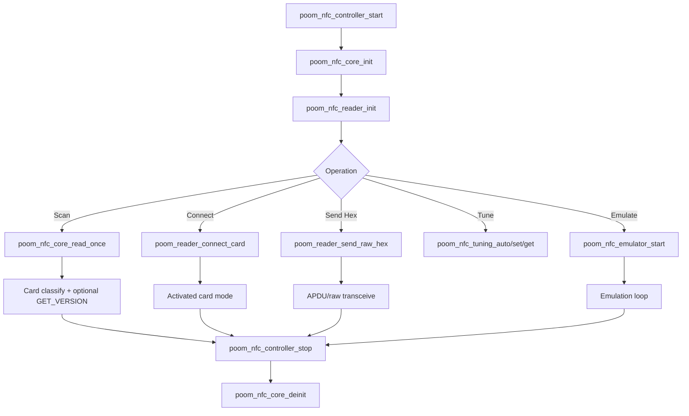

# poom_nfc

`poom_nfc` is the NFC application component used by POOM firmware for reader operations, card identification, raw ISO-DEP exchange, tuning, and local emulation workflows.

This component is designed for lab, diagnostics, and integration testing on ESP-IDF targets using the ST25R3916 RF frontend through the `nfcal` dependency.

## Purpose

This folder contains the NFC high-level logic for:

- NFC stack bootstrap and teardown
- Single-shot multi-technology scan and activation
- NFC-A card classification and `GET_VERSION` probing
- ISO14443-4 / ISO15693 connect-and-send flows
- NFC emulation control and runtime configuration
- Antenna tuning helpers

## Structure

```text
applications/poom_nfc
├── include/
│   ├── poom_nfc_core.h
│   ├── poom_nfc_reader.h
│   ├── poom_nfc_card_ident.h
│   ├── poom_nfc_iso14443_4.h
│   ├── poom_nfc_tuning.h
│   ├── poom_nfc_emulator.h
│   ├── poom_nfc_debug.h
│   └── poom_nfc_controller.h
└── src/
    ├── poom_nfc_core.c
    ├── poom_nfc_reader.c
    ├── poom_nfc_card_ident.c
    ├── poom_nfc_iso14443_4.c
    ├── poom_nfc_tuning.c
    ├── poom_nfc_emulator.c
    ├── poom_nfc_debug.c
    └── poom_nfc_controller.c
```

## Integration

The component is registered by `applications/poom_nfc/CMakeLists.txt` and currently requires:

- `nfcal` (RFAL/ST25R3916 platform integration)

## Public API

### Core lifecycle

- `bool poom_nfc_core_init(void)`
- `bool poom_nfc_core_read_once(uint32_t timeout_ms)`
- `void poom_nfc_core_deinit(void)`

### Reader behavior

- `bool poom_nfc_reader_init(void)`
- `bool poom_nfc_reader_scan_once(rfalNfcDevice **activeDevOut, uint32_t timeout_ms)`
- `bool poom_nfc_reader_active(rfalNfcDevice *dev)`
- `void poom_nfc_reader_set_technology(poom_nfc_reader_tech_t tech)`

### Controller façade

- `bool poom_nfc_controller_start(void)`
- `bool poom_nfc_controller_scan_once(uint32_t timeout_ms)`
- `bool poom_nfc_controller_connect(void)`
- `bool poom_nfc_controller_send_raw_hex(const char *hex_ascii)`
- `void poom_nfc_controller_stop(void)`

### Card identification

- `nfc_card_type_t nfc_ident_detect_nfca(uint16_t atqa, uint8_t sak)`
- `bool nfc_ident_try_get_version(...)`

### ISO14443-4 bridge

- `bool poom_reader_connect_card(void)`
- `bool poom_reader_send_raw_hex(const char *ascii_hex)`

### Tuning and emulation

- `bool poom_nfc_tuning_auto(...)`
- `bool poom_nfc_tuning_set(...)`
- `bool poom_nfc_emulator_start(void)`
- `void poom_nfc_emulator_stop(void)`

## Runtime Flow



## Usage

This section documents the NFC console commands currently registered in `applications/poom_cli/src/cli_nfc.c`.

### Quick Start

```bash
# 1) Iniciar
nfc-core-start

# 2) Elegir tecnología (opcional)
nfc-tech-set-all          # o: nfc-tech-set-a / nfc-tech-set-b / nfc-tech-set-f / nfc-tech-set-v / nfc-tech-set-st25tb
nfc-tech-show         # muestra el filtro actual

# 3) Ver tags cercanos
nfc-scan-run

# 4) Conectar y enviar bytes (APDU o comando raw según tecnología)
nfc-card-connect
nfc-card-send 00 A4 04 00 07 D2 76 00 00 85 01 01 00

# 5) Terminar (apaga campo/limpia estado)
nfc-core-stop
```

### Command Reference

**Basic reader**
- `nfc-core-start`: inicializa NFC (RFAL + IRQ + I2C).
- `nfc-core-stop`: detiene/limpia estado NFC (field off).
- `nfc-scan-run`: escaneo one-shot (según tecnología seleccionada).
- `nfc-scan-run-loop <period_ms> <count> [timeout_ms]`: repite `nfc-scan-run` N veces con periodo fijo.
- `nfc-card-connect`: activa una tarjeta (A/B/15693). Útil antes de `nfc-card-send`.
- `nfc-card-send <hex...>`: envía bytes hex a la tarjeta activa (ISO-DEP para A/B; raw para 15693 según bridge).

**Technology filter**
- `nfc-tech-set-all`, `nfc-tech-set-a`, `nfc-tech-set-b`, `nfc-tech-set-f`, `nfc-tech-set-v`, `nfc-tech-set-st25tb`: selecciona tecnología.
- `nfc-tech-show`: muestra tecnología seleccionada.

**Antenna tuning**
- `nfc-tune-auto-run`: auto-tune (AAT) y muestra resultados.
- `nfc-tune-get`: lee AAT_A/AAT_B + fase/amplitud.
- `nfc-tune-set <aat_a> <aat_b>`: escribe AAT_A/AAT_B y muestra fase/amplitud resultante.

**Save IDs to NVS and dumps to SD**
- `nfc-cards-list`: lista tarjetas guardadas en NVS (índices).
- `nfc-cards-save [timeout_ms]`: escanea y guarda IDs detectados en NVS (para emular luego).
- `nfc-cards-del <index>`: borra una tarjeta guardada por índice.
- `nfc-cards-clear`: borra todas las tarjetas guardadas.
- `nfc-dump-save-sd [timeout_ms]`: escanea y guarda un dump estructurado en la SD (`/nfc_dumps/...`).
- `nfc-mful-save [timeout_ms]`: escanea NFC-A Type2/MFUL y guarda dump estructurado `.nfc` en `/nfc_dumps` (listo para emulación desde menú/CLI).
- `nfc-card-save-current [name]`: guarda el último perfil de `nfc-card-connect` en NVS (key `nfc_profiles`) incluyendo `mode` y `ATS` si existe.
- `nfc-profiles-list`: lista perfiles guardados (mode+UID+ATQA/SAK/ATS + name si existe).
- `nfc-profiles-del <index>`: borra un perfil guardado.
- `nfc-profiles-clear`: borra todos los perfiles guardados.

**Local emulation**
- `nfc-emul-show`: muestra configuración actual de emulación.
- `nfc-emul-reset`: resetea la configuración a defaults (requiere emulación detenida).
- `nfc-emul-set <field> <value>`: configura campos de emulación (requiere emulación detenida).
  - `mode`: `3a` | `t4t` | `mful`
  - `uid`: 4 o 7 bytes hex
  - `sak`: 1 byte hex
  - `atqa`: 2 bytes hex
  - `ats`: bytes ATS completos (TL + body)
  - `uri`: string URI (para modo `t4t`)
  - `image`: path (SD) a imagen MFUL (preferir Flipper `.nfc`; `.bin` sigue soportado por compatibilidad). Para `.bin`: `64`, `180`, `212`, `540` o `572` bytes; también acepta variantes legacy con +4 bytes y las recorta
- `nfc-emul-load-last-connect`: copia el último perfil de `nfc-card-connect` a la config del emulador (UID/ATQA/SAK/ATS + mode).
- `nfc-emul-start-last-connect`: equivalente a `nfc-emul-load-last-connect` + `nfc-emul-start`.
- `nfc-emul-start [stored_index]`: inicia emulación. Si existe un **perfil completo** guardado en `nfc_profiles` usa `mode/ATS`; si no, cae al store viejo (`nfc_cards`) y usa modo `3a`.
- `nfc-emul-stop`: detiene emulación.

**Low-level RFAL and ST25 debug**
- `nfc-reader-verbose-set <0|1>`: habilita prints TX/RX del bridge ISO-DEP.
- `nfc-isodep-chunk-set <1..250>`: tamaño máximo de fragmento (INF) para chaining ISO-DEP (no es negociación FSD/FSC).
- `nfc-rf-turn-on`, `nfc-rf-turn-off`: fuerza campo RF on/off.
- `nfc-mode-get`: muestra modo/bitrates RFAL actuales.
- `nfc-mode-set <mode> <tx_br> <rx_br>`: setea modo/bitrates RFAL (valores numéricos de RFAL).
- `nfc-obsv-get`: lee mux de observation mode.
- `nfc-obsv-set <0|1> [tx] [rx]`: habilita/deshabilita observation mode.
- `nfc-reqa-send`, `nfc-wupa-send`: envía REQA/WUPA (NFC-A) e imprime ATQA.
- `nfc-raw-transceive [--crc-manual] <hex...>`: transceive raw (CRC auto o manual).
- `nfc-regs-dump`: dump de registros ST25R3916 (salida larga).

### Detailed Command Usage

#### Basic reader

**`nfc-core-start`**
- Qué hace: inicializa el stack (I2C/IRQ/RFAL) una vez por boot.
- Cuándo usar: antes de cualquier comando NFC.

**`nfc-core-stop`**
- Qué hace: detiene el core, apaga campo RF y limpia estado.
- Cuándo usar: al finalizar una sesión o si un comando quedó “pegado”.

**`nfc-scan-run`**
- Qué hace: busca tags cercanos con el filtro actual (`nfc-tech-set-a/b/f/v/...`) y los imprime.
- Nota: es one-shot.

**`nfc-scan-run-loop <period_ms> <count> [timeout_ms]`**
- Qué hace: ejecuta `nfc-scan-run` repetidamente `count` veces.
- `period_ms`: tiempo entre scans.
- `timeout_ms`: timeout de cada scan (default 3000).
- Ejemplo: `nfc-scan-run-loop 500 20 1500`

**`nfc-card-connect`**
- Qué hace: activa una tarjeta (A/B/15693) para poder hablar con ella.
- Importante: después de `nfc-card-connect`, el firmware guarda un “snapshot” del último perfil (NFC-A) que puedes copiar al emulador.

**`nfc-card-send <hex...>`**
- Qué hace: envía bytes (hex) a la tarjeta activa.
- Formato hex: acepta `00A4...` o `00 A4 ...` (espacios/`:`/`-`).
- Nota: en ISO-DEP esto es un C-APDU (la respuesta es R-APDU). En 15693 se envía raw.

#### Technology filter

**`nfc-tech-set-all` / `nfc-tech-set-a` / `nfc-tech-set-b` / `nfc-tech-set-f` / `nfc-tech-set-v` / `nfc-tech-set-st25tb`**
- Qué hace: cambia el filtro de tecnologías a escanear.
- Ejemplo: `nfc-tech-set-a` para trabajar solo con ISO14443A.

**`nfc-tech-show`**
- Qué hace: imprime el filtro actual.

#### Antenna tuning

**`nfc-tune-auto-run`**
- Qué hace: corre auto-tuning (AAT) y muestra AAT_A/AAT_B + mediciones.

**`nfc-tune-get`**
- Qué hace: lee AAT_A/AAT_B actuales y fase/amplitud.

**`nfc-tune-set <aat_a> <aat_b>`**
- Qué hace: escribe AAT_A/AAT_B (0..255) y mide fase/amplitud.

#### Save to NVS and SD

**Store viejo `nfc_cards` (IDs)**
- Guarda: `type + uid + (ATQA/SAK si existen)`.
- Se usa por: `nfc-cards-*` y fallback de `nfc-emul-start <idx>`.

**Store nuevo `nfc_profiles` (perfiles completos)**
- Guarda: `mode + uid + ATQA + SAK + ATS + name`.
- Se usa por: `nfc-card-save-current`, `nfc-profiles-*` y `nfc-emul-start <idx>` (prioridad).

**`nfc-cards-save [timeout_ms]`**
- Qué hace: escanea y guarda IDs encontrados.
- Ejemplo: `nfc-cards-save 3000`

**`nfc-cards-list` / `nfc-cards-del <idx>` / `nfc-cards-clear`**
- Qué hacen: listan / borran uno / borran todo en `nfc_cards`.

**`nfc-card-save-current [name]`**
- Qué hace: guarda el último perfil capturado por `nfc-card-connect` dentro de `nfc_profiles`.
- Requiere: ejecutar `nfc-card-connect` antes.
- Ejemplo: `nfc-card-save-current mi_tag`

**`nfc-profiles-list` / `nfc-profiles-del <idx>` / `nfc-profiles-clear`**
- Qué hacen: listan / borran uno / borran todo en `nfc_profiles`.

**`nfc-dump-save-sd [timeout_ms]`**
- Qué hace: guarda un dump estructurado a la SD (útil para análisis).

**`nfc-mful-save [timeout_ms]`**
- Qué hace: guarda dump MFUL/Type2 en `.nfc` dentro de `/nfc_dumps` para emulación.
- Firma: si `READ_SIG (0x3C)` responde, se guarda en el campo `Signature:` del `.nfc`.
- Compatibilidad: el emulador carga `.nfc` Flipper/POOM y `.bin` legacy.

#### Local emulation

**`nfc-emul-show`**
- Qué hace: imprime config de emulación actual.
- Nota: en modo `mful`, el campo `uri` se muestra pero se ignora (solo aplica a `t4t`).

**`nfc-emul-reset`**
- Qué hace: vuelve a defaults. Requiere emulación detenida.

**`nfc-emul-set <field> <value>`**
- Qué hace: cambia un campo de config (con emulación detenida).
- Ejemplos:
  - `nfc-emul-set mode t4t`
  - `nfc-emul-set uid 04112233445566`
  - `nfc-emul-set atqa 0044`
  - `nfc-emul-set sak 00`
  - `nfc-emul-set ats 06757781028000`
  - `nfc-emul-set uri https://example.com/`
  - `nfc-emul-set image /sdcard/nfc_dumps/nfc_xxx.nfc`
  - `nfc-emul-set image /sdcard/NTAG213_2024_BRICK.nfc`

**`nfc-emul-load-last-connect`**
- Qué hace: copia el último perfil de `nfc-card-connect` al emulador (UID/ATQA/SAK/ATS + mode).
- Requiere: ejecutar `nfc-card-connect` antes (y que sea NFC-A para tener UID/ATQA/SAK/ATS).

**`nfc-emul-start-last-connect`**
- Qué hace: atajo de `nfc-emul-load-last-connect` + `nfc-emul-start`.

**`nfc-emul-start [stored_index]`**
- Sin argumento: inicia emulación con la config actual.
- Con índice: primero intenta cargar un perfil completo desde `nfc_profiles` (respeta `mode/ATS`), si no existe usa `nfc_cards` y configura modo `3a`.
- Tip: usa `nfc-profiles-list` o `nfc-cards-list` para ver índices.

**`nfc-emul-stop`**
- Qué hace: detiene la emulación.

#### Low-level RFAL and ST25 debug

**`nfc-reader-verbose-set <0|1>`**
- Qué hace: habilita prints TX/RX del bridge ISO-DEP (útil para ver RATS/ATS y APDUs).

**`nfc-isodep-chunk-set <1..250>`**
- Qué hace: ajusta el tamaño de fragmento para chaining ISO-DEP (no es negociación FSD/FSC).

**`nfc-raw-transceive [--crc-manual] <hex...>`**
- Qué hace: transceive raw directo a RFAL (debug).
- Nota: `--crc-manual` fuerza flags de CRC manual.

**`nfc-regs-dump`**
- Qué hace: imprime registros del ST25R3916 (salida larga).

### Example Session

```bash
nfc-core-start
nfc-tech-set-all
nfc-scan-run
nfc-card-connect
nfc-card-send 00 A4 04 00 0E 32 50 41 59 2E 53 59 53 2E 44 44 46 30 31 00
nfc-core-stop
```

### Useful Examples

**1) Guardar un tag NFC-A y emularlo (UID/ATQA/SAK)**

```bash
nfc-core-start
nfc-tech-set-a
nfc-cards-save 3000
nfc-cards-list
nfc-emul-start 0
```

**2) Emular Type 4 Tag con URI**

```bash
nfc-core-start
nfc-emul-reset
nfc-emul-set mode t4t
nfc-emul-set uid 04112233445566
nfc-emul-set uri https://example.com/
nfc-emul-start
```

**3) Emular MF Ultralight/NTAG desde archivo**

```bash
nfc-core-start
nfc-emul-reset
nfc-emul-set mode mful
nfc-emul-set uid 04112233445566
nfc-emul-set image /sdcard/nfc_dumps/nfc_xxx.nfc
nfc-emul-start
```

## Integration

- MIFARE Classic support includes session/auth helpers; secure read/write paths depend on lower-level link constraints and may be limited depending on current backend behavior.
- Card detection and `GET_VERSION` parsing are best-effort and card-family dependent.
- This component is intended for authorized testing and development environments.


Use NFC reading/emulation features only in authorized environments and in compliance with local laws and policies.
