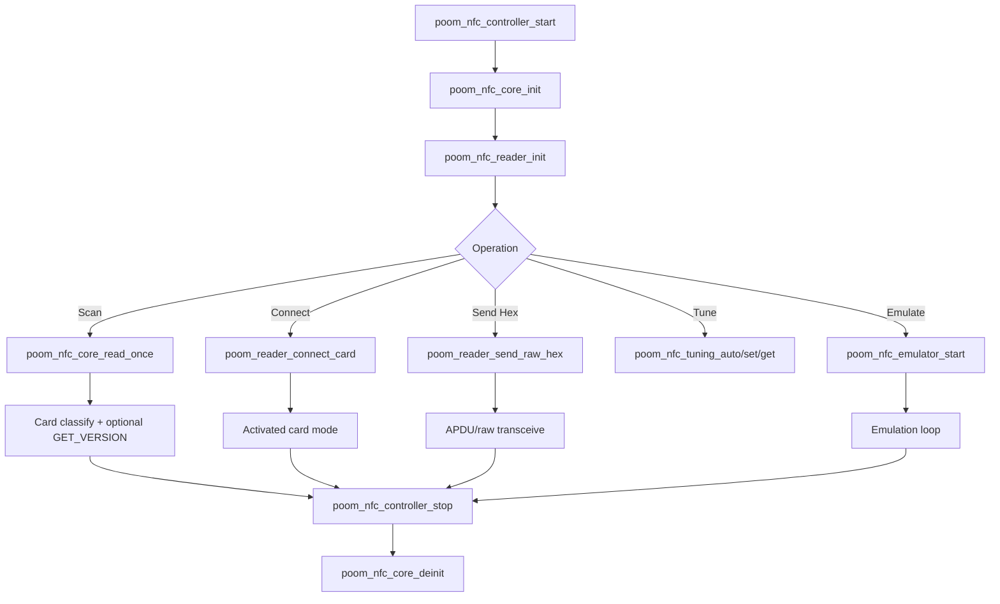

# poom_nfc

`poom_nfc` is the high-level NFC application component used by POOM firmware for:

- reader operations
- card identification
- raw ISO-DEP exchange
- antenna tuning
- local NFC emulation
- MIFARE Classic authentication, read/write, and dump workflows

It is intended for lab, diagnostics, integration testing, and authorized development on ESP-IDF targets using the ST25R3916 RF frontend through the `nfcal` component hosted in `third-party/nfcal`.

## Purpose

This component contains the application-facing NFC logic for:

- NFC stack bootstrap and teardown
- single-shot multi-technology scan and activation
- NFC-A classification and `GET_VERSION` probing
- ISO/IEC 14443-4 and ISO/IEC 15693 connect/send flows
- local emulator control and runtime configuration
- antenna tuning helpers
- MIFARE Classic key discovery, authentication, block access, and export

## Structure

```text
applications/poom_nfc
├── include/
│   ├── poom_nfc_core.h
│   ├── poom_nfc_reader.h
│   ├── poom_nfc_card_ident.h
│   ├── poom_nfc_iso14443_4.h
│   ├── poom_nfc_mifare_classic.h
│   ├── poom_nfc_tuning.h
│   ├── poom_nfc_emulator.h
│   ├── poom_nfc_debug.h
│   └── poom_nfc_controller.h
└── src/
    ├── poom_nfc_core.c
    ├── poom_nfc_reader.c
    ├── poom_nfc_card_ident.c
    ├── poom_nfc_iso14443_4.c
    ├── poom_nfc_mifare_classic.c
    ├── poom_nfc_tuning.c
    ├── poom_nfc_emulator.c
    ├── poom_nfc_debug.c
    └── poom_nfc_controller.c
```

## Integration

The component is registered by `applications/poom_nfc/CMakeLists.txt` and currently requires:

- `nfcal` - RFAL/ST25R3916 platform integration from `third-party/nfcal`
- `poom_secrets_store`
- `sd_card`

## License

`poom_nfc` source files are licensed under `GPL-3.0-or-later`.

## Public API

### Core lifecycle

- `bool poom_nfc_core_init(void)`
- `bool poom_nfc_core_read_once(uint32_t timeout_ms)`
- `void poom_nfc_core_deinit(void)`

### Reader behavior

- `bool poom_nfc_reader_init(void)`
- `bool poom_nfc_reader_scan_once(rfalNfcDevice **activeDevOut, uint32_t timeout_ms)`
- `bool poom_nfc_reader_active(rfalNfcDevice *dev)`
- `void poom_nfc_reader_set_technology(poom_nfc_reader_tech_t tech)`

### Controller facade

- `bool poom_nfc_controller_start(void)`
- `bool poom_nfc_controller_scan_once(uint32_t timeout_ms)`
- `bool poom_nfc_controller_connect(void)`
- `bool poom_nfc_controller_send_raw_hex(const char *hex_ascii)`
- `void poom_nfc_controller_stop(void)`

### Card identification

- `nfc_card_type_t nfc_ident_detect_nfca(uint16_t atqa, uint8_t sak)`
- `bool nfc_ident_try_get_version(...)`

### ISO/IEC 14443-4 bridge

- `bool poom_reader_connect_card(void)`
- `bool poom_reader_send_raw_hex(const char *ascii_hex)`
- `bool poom_reader_isodep_transceive_apdu(...)`

### ISO7816 / TLV / EMV

- `bool poom_iso7816_parse_rapdu(...)`
- `size_t poom_iso7816_build_select_df_name(...)`
- `bool poom_nfc_emv_select_ppse(...)`
- `bool poom_nfc_emv_select_aid(...)`
- `bool poom_nfc_emv_parse_ppse_apps(...)`

### MIFARE Classic

- `bool poom_mifare_classic_auth(uint8_t block, poom_mifare_key_type_t key_type, const uint8_t key[6])`
- `bool poom_mifare_classic_read_block(uint8_t block, uint8_t out_data[16])`
- `bool poom_mifare_classic_write_block(uint8_t block, const uint8_t data[16])`
- `bool poom_mifare_classic_discover_default_keys(bool try_key_b)`
- `bool poom_mifare_classic_dump_to_flipper_file(...)`
- `bool poom_mifare_classic_dump_to_poom_memory_file(...)`

### Tuning and emulation

- `bool poom_nfc_tuning_auto(...)`
- `bool poom_nfc_tuning_set(...)`
- `bool poom_nfc_emulator_start(void)`
- `void poom_nfc_emulator_stop(void)`

## Runtime Flow



## CLI Usage

This section documents the NFC console commands currently registered in `applications/poom_cli/src/cli_nfc.c`.

### Quick Start

```bash
# 1) Start the NFC stack
nfc-core-start

# 2) Optionally select a technology filter
nfc-tech-set-all          # or: nfc-tech-set-a / nfc-tech-set-b / nfc-tech-set-f / nfc-tech-set-v / nfc-tech-set-st25tb
nfc-tech-show

# 3) Scan for nearby tags
nfc-scan-run

# 4) Connect and exchange bytes
nfc-card-connect
nfc-card-send 00 A4 04 00 07 D2 76 00 00 85 01 01 00

# 5) Stop and clean up
nfc-core-stop
```

## Command Reference

### Basic reader

- `nfc-core-start` - initialize NFC (RFAL + IRQ + I2C)
- `nfc-core-stop` - stop NFC and clear runtime state
- `nfc-scan-run` - run a one-shot scan using the current technology filter
- `nfc-scan-run-loop <period_ms> <count> [timeout_ms]` - repeat the scan multiple times
- `nfc-card-connect` - activate a nearby card before talking to it
- `nfc-card-send <hex...>` - send hex bytes to the active card

### Technology filter

- `nfc-tech-set-all`
- `nfc-tech-set-a`
- `nfc-tech-set-b`
- `nfc-tech-set-f`
- `nfc-tech-set-v`
- `nfc-tech-set-st25tb`
- `nfc-tech-show`

### Antenna tuning

- `nfc-tune-auto-run`
- `nfc-tune-get`
- `nfc-tune-set <aat_a> <aat_b>`

### NVS and SD storage

- `nfc-cards-list`
- `nfc-cards-save [timeout_ms]`
- `nfc-cards-del <index>`
- `nfc-cards-clear`
- `nfc-card-save-current [name]`
- `nfc-profiles-list`
- `nfc-profiles-del <index>`
- `nfc-profiles-clear`
- `nfc-dump-save-sd [timeout_ms]`
- `nfc-mful-save [timeout_ms]`

### MIFARE Classic

- `nfc-mfc-discover [-b]`
- `nfc-mfc-auth-a <block> <key>`
- `nfc-mfc-auth-b <block> <key>`
- `nfc-mfc-read <block>`
- `nfc-mfc-write <block> <hex...>`
- `nfc-mfc-keys <block>`
- `nfc-mfc-dump [-b]`
- `nfc-mfc-dump-poom [-b]`

### Local emulation

- `nfc-emul-show`
- `nfc-emul-reset`
- `nfc-emul-set <field> <value>`
- `nfc-emul-load-last-connect`
- `nfc-emul-start-last-connect`
- `nfc-emul-start [stored_index]`
- `nfc-emul-stop`

### Low-level RFAL/ST25 debug

- `nfc-reader-verbose-set <0|1>`
- `nfc-isodep-chunk-set <1..250>`
- `nfc-rf-turn-on`
- `nfc-rf-turn-off`
- `nfc-mode-get`
- `nfc-mode-set <mode> <tx_br> <rx_br>`
- `nfc-obsv-get`
- `nfc-obsv-set <0|1> [tx] [rx]`
- `nfc-reqa-send`
- `nfc-wupa-send`
- `nfc-raw-transceive [--crc-manual] <hex...>`
- `nfc-regs-dump`

## Detailed Notes

### Basic reader

**`nfc-core-start`**

- Initializes the RFAL/I2C/IRQ stack once per boot.
- Use it before any NFC command.

**`nfc-core-stop`**

- Stops the NFC core, turns the RF field off, and clears runtime state.
- Use it when you are done or when a session got stuck.

**`nfc-scan-run`**

- Scans for nearby tags with the current filter.
- One-shot only.

**`nfc-scan-run-loop <period_ms> <count> [timeout_ms]`**

- Repeats `nfc-scan-run` `count` times.
- `period_ms` is the delay between scans.
- `timeout_ms` is the timeout per scan. Default is `3000`.

**`nfc-card-connect`**

- Activates a card so later commands can talk to it.
- For NFC-A cards, it also stores a last activation snapshot that can be reused by the emulator.

**`nfc-card-send <hex...>`**

- Sends raw hex bytes to the active card.
- Accepts `00A4...` and spaced hex such as `00 A4 ...`.
- On ISO-DEP cards, this is typically a C-APDU. On ISO15693, it is sent raw.

### Storage

**Legacy store: `nfc_cards`**

- Stores `type + uid + optional ATQA/SAK`.
- Used by `nfc-cards-*` and as a fallback for `nfc-emul-start <idx>`.

**Profile store: `nfc_profiles`**

- Stores `mode + uid + ATQA + SAK + ATS + optional name`.
- Used by `nfc-card-save-current`, `nfc-profiles-*`, and preferred by `nfc-emul-start <idx>`.

**`nfc-dump-save-sd [timeout_ms]`**

- Saves a structured dump to SD for analysis.
- Output format: `POOM NFC device` (not Flipper format).

**`nfc-mful-save [timeout_ms]`**

- Saves an MFUL/Type 2 `.nfc` dump to `/nfc_dumps` for emulation.
- If `READ_SIG (0x3C)` succeeds, the signature is included in the `.nfc`.
- The emulator supports Flipper-style `.nfc`, POOM `.nfc`, and legacy `.bin`.

### EMV / ISO7816

Recommended flow:

```bash
nfc-core-start
nfc-card-connect
nfc-emv-discover
nfc-emv-select A0000000041010
```

**`nfc-emv-discover`**

- Selects PPSE (`2PAY.SYS.DDF01`) over ISO-DEP.
- Parses BER-TLV and lists advertised payment applications.
- Prints AID, Application Label, and priority when present.
- Treats non-`90 00` replies as valid R-APDUs, not NFC transport failures.

**`nfc-emv-select <AID>`**

- Selects one EMV application by AID.
- AID is passed as hex, for example `A0000000041010`.
- Prints the returned status words and, in verbose reader mode, a decoded TLV view.

### MIFARE Classic

Recommended flow:

```bash
nfc-core-start
nfc-card-connect
nfc-mfc-discover
nfc-mfc-read 4
nfc-mfc-write 4 00112233445566778899AABBCCDDEEFF
nfc-mfc-dump
nfc-mfc-dump-poom
```

**`nfc-mfc-discover [-b]`**

- Probes sector keys using the built-in dictionary.
- It tries the 4 most common keys first, then the rest of the dictionary.
- Output stays short, for example: `sector 1 keyA FFFFFFFFFFFF`.
- `-b` also probes Key B.

**`nfc-mfc-auth-a <block> <key>` / `nfc-mfc-auth-b <block> <key>`**

- Authenticates the sector that contains the given block.
- Keys are 6-byte hex values such as `FFFFFFFFFFFF`.

**`nfc-mfc-read <block>`**

- Reads a 16-byte block.
- Requires a valid cached key for that sector, learned through manual auth or discovery.

**`nfc-mfc-write <block> <hex...>`**

- Writes 16 bytes to a data block.
- Requires a valid cached key for that sector.
- `block 0` of sector 0 is treated as the manufacturer block and is not written on normal MIFARE Classic cards.
- Writing a sector trailer is dangerous because it contains keys and access bits.

**`nfc-mfc-keys <block>`**

- Shows known Key A / Key B values for the sector of the given block.
- MIFARE Classic uses per-sector keys, not per-block passwords.

**`nfc-mfc-dump [-b]`**

- Reads blocks and saves a Flipper-compatible MIFARE Classic `.nfc` file.
- Always writes to `/nfc` on SD.
- Requires the card to stay present during the dump.
- Uses known sector keys and can optionally try Key B with `-b`.

**`nfc-mfc-dump-poom [-b]`**

- Reads blocks and saves a POOM MIFARE Classic memory image as `.nfc`.
- The file keeps a POOM header and a block-oriented body (`Block N: ...`).
- Appends a short per-sector key summary when keys are known.
- Always writes to `/nfc` on SD.
- Uses a `_poom.nfc` suffix so it does not overwrite the Flipper dump.
- Requires the card to stay present during the dump.

### Local emulation

**`nfc-emul-set <field> <value>`**

Fields include:

- `mode`: `3a`, `t4t`, `mful`
- `uid`: 4-byte or 7-byte hex UID
- `sak`: 1-byte hex
- `atqa`: 2-byte hex
- `ats`: full ATS bytes
- `uri`: URI string for `t4t`
- `image`: SD path to an MFUL image, preferably a Flipper-style `.nfc`

Examples:

```bash
nfc-emul-set mode t4t
nfc-emul-set uid 04112233445566
nfc-emul-set ats 06757781028000
nfc-emul-set uri https://example.com/
```

### Low-level debug

**`nfc-reader-verbose-set <0|1>`**

- Enables or disables bridge TX/RX prints.
- Useful for seeing activation, RATS/ATS, and APDU exchanges.

**`nfc-isodep-chunk-set <1..250>`**

- Adjusts the ISO-DEP chaining fragment size.
- This is not RFAL FSD/FSC negotiation.

**`nfc-raw-transceive [--crc-manual] <hex...>`**

- Sends raw frames directly through RFAL for debugging.
- `--crc-manual` forces manual CRC flags.

## Example Sessions

### Save an NFC-A tag and emulate it

```bash
nfc-core-start
nfc-tech-set-a
nfc-cards-save 3000
nfc-cards-list
nfc-emul-start 0
```

### Emulate a Type 4 Tag with a URI

```bash
nfc-core-start
nfc-emul-reset
nfc-emul-set mode t4t
nfc-emul-set uid 04112233445566
nfc-emul-set uri https://example.com/
nfc-emul-start
```

### Emulate MFUL/NTAG from a file

```bash
nfc-core-start
nfc-emul-reset
nfc-emul-set mode mful
nfc-emul-set uid 04112233445566
nfc-emul-set image /sdcard/nfc_dumps/nfc_xxx.nfc
nfc-emul-start
```
